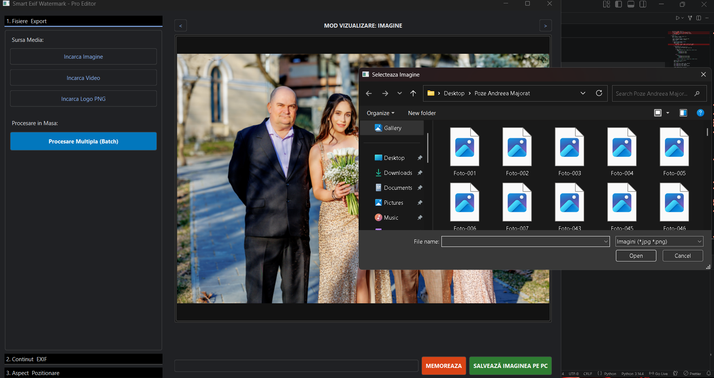
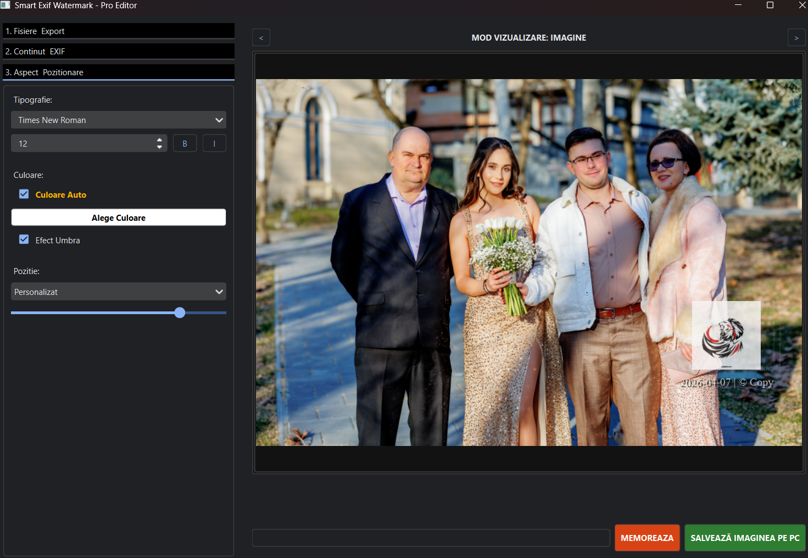
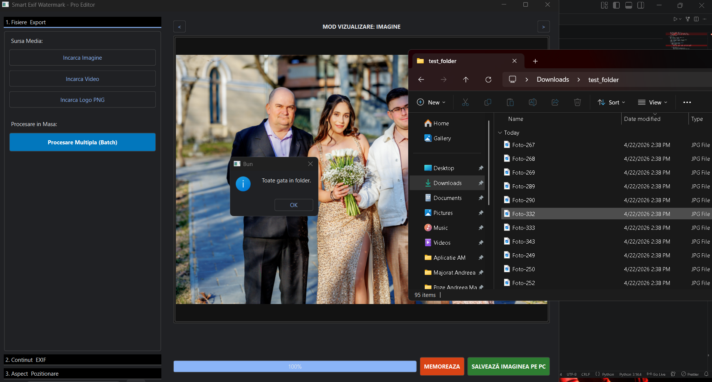

# Smart Exif Watermark – Pro Editor


---

## 📌 Descriere

Smart Exif Watermark – Pro Editor este o aplicație de calculator care ajută la protejarea fișierelor multimedia, precum imagini și videoclipuri, prin adăugarea de watermark-uri vizibile și gestionarea inteligentă a datelor EXIF.

Acest proiect a fost dezvoltat ca parte a unui curs de Multimedia Avansate și își propune să ofere o soluție rapidă și sigură pentru procesarea fișierelor multimedia direct pe calculatorul utilizatorului.

Aplicația permite editarea vizuală a fișierelor, precum și analiza automată a conținutului imaginii. Utilizatorul poate adăuga watermark-uri text, logo-uri, informații EXIF dinamice și coduri QR. Sistemul va determina automat cele mai bune locuri pentru a plasa aceste elemente, fără a afecta părțile importante ale imaginii.

---

## ✨ Funcționalități principale

- procesarea fișierelor direct pe calculator, fără a fi nevoie de conexiune la internet
- adăugarea de watermark-uri text și logo
- extragerea și afișarea dinamică a datelor EXIF
- generarea și inserarea de coduri QR
- eliminarea coordonatelor GPS și a datelor sensibile
- detectarea automată a zonelor potrivite pentru plasarea watermark-ului
- adaptarea automată a culorii textului în funcție de fundal
- procesarea paralelă a loturilor de fișiere pentru o eficiență sporită

---

## 🖼️ Formate suportate

Aplicația suportă imagini în format JPEG și PNG, precum și fișiere video MP4. Pentru videoclipuri, este disponibil un timeline interactiv care permite utilizatorului să verifice poziționarea watermark-ului în diferite momente ale clipului.

---

## 🧩 Structura aplicației

Aplicația este structurată în trei componente principale:

- **Interfata.py**: gestionează interacțiunea cu utilizatorul și zona de previzualizare
- **Logica.py**: administrează parametrii de editare, poziționarea și configurarea internă
- **MultiProcess.py**: gestionează randarea finală și procesarea paralelă a loturilor de fișiere

### Structură directoare

```text
Smart-Exif-Watermark/
│
├── Interfata.py
├── Logica.py
├── MultiProcess.py
├── assets/
│   ├── icons/
│   └── logos/
├── samples/
│   ├── images/
│   └── videos/
└── README.md
```
## 🛠️ Tehnologii utilizate

Tehnologiile folosite în acest proiect includ Python, PyQt6 pentru interfața grafică, OpenCV pentru procesarea de imagine și video, Pillow și ExifRead pentru metadate EXIF, qrcode pentru generarea codurilor QR și multiprocessing pentru execuția paralelă.

## ⚙️ Instalare
```bash
git clone https://github.com/username/smart-exif-watermark.git
cd smart-exif-watermark
pip install -r requirements.txt
python Interfata.py
```

---
## 🧠 Poziționare inteligentă

Pentru a plasa inteligent watermark-ul, aplicația analizează structura imaginii folosind un detector de margini specializat. Acesta identifică zonele cu puține detalii, considerate sigure pentru plasarea elementelor grafice fără a afecta subiectul principal.

## 🎨 Adaptare automată a culorii

Pentru a adapta automat culoarea textului, aplicația calculează luminanța locală a regiunii folosind o formulă standard. În funcție de valoarea rezultată, culoarea watermark-ului este ajustată automat pentru a păstra contrastul și lizibilitatea.

## 🔒 Privacy Shield

Funcția Privacy Shield este un element important al proiectului. La export, aplicația poate elimina automat coordonatele GPS și identificatorii hardware sensibili, păstrând în același timp metadatele relevante pentru drepturile de autor și proprietatea intelectuală.

---

## 📊 Performanță

În testele efectuate pe un set de 100 de imagini cu rezoluție mare, procesarea paralelă a redus timpul total de procesare de la aproximativ 210 secunde la aproximativ 38 de secunde. Algoritmul de poziționare inteligentă a identificat corect zonele potrivite în aproximativ 94% dintre cazuri.

## 🖥️ Capturi de ecran

Adaugă aici capturi din interfața aplicației.


## Fig.1 Interfata Principala

## Fig.2 Zona Watermark fotografie

## Fig.3 Procesare Batch
## 🎯 Obiectiv

Scopul acestui proiect este de a transforma metadatele dintr-o vulnerabilitate într-un instrument controlat de protecție, branding și autenticitate digitală, oferind un editor multimedia local, rapid și orientat spre siguranța datelor.
